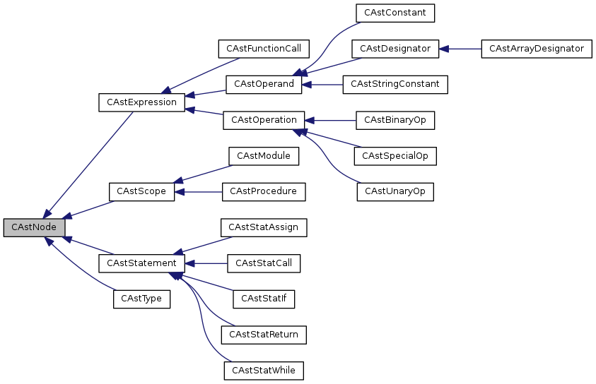

# SnuPL/2 Compiler

[[_toc_]]

## Logistics

### Teamwork

Complete this phase in your team.


### Hand-out

This repository contains all files up to phase 3. This means that you need to update your fork to reflect those changes. In Git speak, this can be achieved by *rebasing* your fork. Instructions on how to do this were provided in [Phase 2](2.Syntax.Analysis.md#hand-out).


### Submission

Tag your submission with "Submission Phase 3". A brief howto on tagging was provided in [Phase 1](1.Lexical.Analysis.md#submission).


## Phase 3: Syntax Analysis

In this third phase of our term project, we implement semantic analysis and evaluate constant expressions.

After completing the previous phase your parser prints the parsed input as an abstract syntax tree. If you have used the provided AST skeleton (in ast.cpp/h), then the coding required in this third phase is moderate. If you have used your own AST, implementing all the necessary functions for type checking may cause some work. Alternatively, you can also switch to the provided AST skeleton at this point in time.

The only handout for this phase is a new Makefile and a test driver that invokes semantic analysis. The code for the semantic checks should be added directly into your compiler obtained in phase 2. 


### 1. Prerequisite: Completing the AST

Most of you already construct the AST as a side-product of syntax analysis in phase 2. If not, now is the time to do so.
Study the file `ast.h` and its implementation in `ast.cpp`. As usual, you can use the command 
```bash
    snuplc $ make doc
```
to build the Doxygen documentation for SnuPL/-1 (and the AST). 



The drawing above shows the class diagram of the AST. During the top-down parse in the parser you can directly build the AST. Each of the parser’s methods that implement a non-terminal return the appropriate AST node. Many AST nodes have a one-to-one correspondence to the parse methods of your top-down parser: the method module() of the parser returns a CAstModule class instance; a function/procedure a CAstProcedure instance, and so on.

Statement sequences are realized by using the SetNext()/GetNext() methods of CAstStatement; i.e., there is no explicit node implementing a statement sequence. This makes the class hierarchy a bit simpler, but has the disadvantage that statement lists need to be traversed explicitly wherever they can occur (i.e., in module, procedure/function, while and if-else bodies). 


### 2. Semantic Analysis

The first part of this assignment is to perform semantic analysis. In particular, your compiler  must check
* the types of the operands in expressions
* the types of the LHS and RHS in assignments
* the type of the bound variable and its definition in the symbol table
* the types of procedure/function arguments
* the number of procedure/function arguments
* catch invalid constants


The type system is described in the [project outline](resources/0.SnuPL.Compiler.Project.pdf). Different SnuPL/2 types are not compatible with each other at the source code level (with the exception of optionally allowing integer types to be automatically converted to longints). Use the provided type manager in snuplc/src/type.[h/cpp] to obtain a reference to one of the basic types in SnuPL/2: long integers, integers, characters, booleans, and the NULL type. The methods `CTypeManager::GetLongint()/GetInteger()/GetChar()/GetBool()/GetNull()` return a reference to a long integer, integer, character, boolean or NULL (void) type, respectively.
Composite types such as arrays and pointers are also managed by the type manager. Have a look at `CTypeManager::GetPointer()/GetArray()`.

The AST provides two methods to perform type checking:
* `const CType* GetType()`
* `bool TypeCheck(CToken *t, string *msg)`

`CAstNode::GetType()` (and its implementations in subclasses) performs *type inference*, i.e., these methods must return the type of the node. Scope, statement, and type nodes that have no type return the Null type (`CTypeManager::GetNull()`). Expression nodes, on the other hand, return NULL for invalid types. Many of the `GetType()` methods are already provided; you need to implement `GetType()` for `CAstBinaryOp`, `CAstUnaryOp`, `CAstSpecialOp`, `CAstArrayDesignator`, and `CAstStringConstant`. In addition, you need to complete four routines in the type system (`CPointerType::Match/Compare()`, and `CArrayType::Match/Compare()`).

`CAstNode::TypeCheck()` performs *type checking*. For binary operations, for example, type checking involves checking whether the operation is defined for the types of the left- and right-hand side of the expression and whether the two types match. For nodes representing a sequence of statements, you need to explicitly call `TypeCheck()` on all statements. Subroutine calls need to check whether the provided arguments match the parameters (number, types), and that the type of the return statement matches the return type of the function, and so on.

Type checks are performed bottom up. Implement the `GetType()`/`TypeCheck()` methods such that they
* return the correct type for the operation
* perform type checks on all statements, if the node contains a statement list
* recursively perform type checks on expressions

As an example, the code below shows the reference implementation of the type checking code for `CAstScope`:
```C
bool CAstScope::TypeCheck(CToken *t, string *msg) const
{
  bool result = true;

  try {
    CAstStatement *s = _statseq;
    while (result && (s != NULL)) {
      result = s->TypeCheck(t, msg);
      s = s->GetNext();
    }

    vector<CAstScope*>::const_iterator it = _children.begin();
    while (result && (it != _children.end())) {
      result = (*it)->TypeCheck(t, msg);
      it++;
    }
  } catch (...) {
    result = false;
  }

  return result;
}
```

Since `CAstModule` and `CAstProcedure` are subclasses of `CAstScope`, the above implementation takes care of both. The first while loop traverses the statement list and type checks each statement. The second loop traverses the children of the scope (in our case, only the module node can contain sub-scopes in the form of procedures/functions). 

The following code shows the implementation of the return statement's type check. The first line retrieves the type of the enclosing scope. For the module body and procedures, this should return the Null type; for functions, the returned type is one of the available scalar types (note that the reference implementation does not support composite types as return types). Depending on whether a type is expected (scope type not Null) or not, different type checks are performed.

```C
bool CAstStatReturn::TypeCheck(CToken *t, string *msg) const
{
  const CType *st = GetScope()->GetType();
  CAstExpression *e = GetExpression();

  if (st->Match(CTypeManager::Get()->GetNull())) {
    if (e != NULL) {
      if (t != NULL) *t = e->GetToken();
      if (msg != NULL) *msg = "superfluous expression after return.";
      return false;
    }
  } else {
    if (e == NULL) {
      if (t != NULL) *t = GetToken();
      if (msg != NULL) *msg = "expression expected after return.";
      return false;
    }

    if (!e->TypeCheck(t, msg)) return false;

    if (!st->Match(e->GetType())) {
      if (t != NULL) *t = e->GetToken();
      if (msg != NULL) *msg = "return type mismatch.";
      return false;
    }
  }

  return true;
}
```

#### Parsing of negative integer constants

The parsing of `MIN_INT` / `MIN_LLONG` is tricky because, according to the SnuPL/2 grammar, the minus (`-`) in front 
of a numeric constant is not part of the number iself but a separate grammar element. Consider the parse tree for "-5":
```
       simpleexpr
       /      |
     "-"    term
              |
            factor
              |
            number
              |
              5
```

This leads to problems when checking for integer bounds because `abs(MIN_INT) > abs(MAX_INT)`. When parsing `MIN_INT = -2147483648`, the conversion of "2147483648" will cause an integer overflow during type checking because the value is larger than `MAX_INT`. The same applies to long integers.

In the following, we discuss three approaches to deal with this. 

##### Strict implementation of SnuPL/2 EBNF
A strict implementation does not fold the minus sign in front of a constant. Since `number` accepts only positive numbers, there is no way to directly represent `MIN_INT`; the programmers have to write an expression that computes `MIN_INT`. For example:
```C
  minint = -2147483647 - 1;
```

If you choose to implement this variant, test your compiler with `test/semanal/int_const_strict.mod`.


##### Simple constant folding
A simple workaround to allow `MIN_INT` is to fold the leading minus sign with the following term if the term is a constant. In the implementation of the `simpleexpr` production, we check whether the `term` production was preceeded by a minus operator. If so and the `term` node is of type `CAstConstant` and an integer type, we negate the value of the constant.

This is a slighly inaccurate interpretation of the SnuPL/2 grammar and leads to unintuitive behavior since `-MIN_INT + ...` is accepted, but `-MIN_INT * ...` is not. 
To understand why consider the parse trees
```
    -2147483648 + 5                       -2147483648 * 5

       simpleexpr                            simpleexpr
     /   |     |   \                         /        \
   "-"  term  "+"  term                    "-"       term
         |          |                              /   |   \
       factor     factor                      factor  "*"  factor
         |          |                           |             |
       number     number                      number       number
         |          |                           |             |
    2147483648      5                      2147483648         5
```
The corresponding ASTs are shown below. In the left case, the first term is represented by an CAstConstant node which can be easily folded with the "-" sign to its left. In case of a multiplication, however, the (first) term is of type `CAstBinaryOp` and cannot be folded.
```
       simpleexpr                            simpleexpr
     /   |     |   \                         /       \
   "-"  term  "+"  term                    "-"      term
      (of type)  (of type)                        (of type)
    CAstConstant CAstConstant                    CAstBinaryOp
                                                 /     |     \
         ^                                    factor  "*"  factor
         |                                  (of type)     (of type)
fold "-" w/ CAstConstant                  CAstConstant   CAstConstant
```

If you choose this implementation, test your compiler with `test/semanal/int_const_simple.mod`.


##### Relaxed constant folding

This variant folds the negation operator with an immediately following constant.

Relaxed constant folding improves the unintuitive behavior of simple constant folding by also folding integer constants if they appears as the leftmost leaf in the `term` expression following the preceeding unary minus operator in simpleexpr. 
I.e., for the parse trees from above
```
    -2147483648 + 5                       -2147483648 * 5

       simpleexpr                            simpleexpr
     /   |     |   \                         /        \
   "-"  term  "+"  term                    "-"       term
         |          |                              /   |   \
       factor     factor                      factor  "*"  factor
         |          |                           |             |
       number     number                      number       number
         |          |                           |             |
    2147483648      5                      2147483648         5
```

we first identify the leftmost leaf in the first term and fold if it is a `CAstConstant`:
```
       simpleexpr                            simpleexpr
     /   |     |   \                         /        \
   "-"  term  "+"  term                    "-"       term
     (of type)    (of type)                        (of type)
   CAstConstant  CAstConstant                     CAstBinaryOp
         ^                                       /     |     \
         |                                  factor    "*"    factor
   fold "-" w/ CAstConstant               (of type)         (of type)
                                        CAstConstant       CAstConstant
                                              ^
                                              |
                                        fold "-" w/ CAstConstant
```

This approach causes another problem: the AST does not retain any information about parentheses in expressions. We can thus not blindly fold unary minus operators followed by a `CAstConstant` leaf node because we would then wrongly accept expressions such as 
```
    i := -(2147483648 + 5)
```
or even worse (b is of boolean type here)
```
    b := -(1 > 0)
```

The workaround is to keep some information about parentheses in the AST. The SnuPL/2 compiler does not represent parentheses as explicit nodes in the AST; instead, it adds a "parenthesized" flag to the `CAstExpression` class. The parser needs to set this flag, and during type checking, we stop the folding operation at the first node that has the flag set.

A test program for this variant is provided in `test/semanal/int_const_relaxed.mod`.


#### Notes
* Location of semantic checks (`parser.cpp` vs. `ast.cpp`)  
  Certain tests are easier to implement in the parser such as the function identifier check. There is no strict rule what should go where, you are free to choose. Nevertheless, try to keep semantic analysis in the AST and perform semantic actions in the parser only if necessary.  
  The reference implementation performs the following semantic check in the parser:
  * module/subroutine identifier match (in `CParser::module/subroutineDecl`)
  * duplicate subroutine/variable declaration (in `CParser::subroutineDecl/varDeclSequence`)
  * (scalar) return type for functions (in `CParser::subroutineDecl`)
  * declaration before use (because `CAstDesignator` requires a symbol; in `CParser::qualident`)
  * subroutine calls require a valid symbol (in `CParser::subroutineCall`)
  * array dimensions provided for array declarations (in `CParser::type/typep`)
  * array dimension constants > 0 (in `CParser::type/typep`)
  * basic longint range checks 0 ~ 2<sup>64</sup>-1  
    (type-specific range checks are performed in `CAstConstant::TypeCheck()`)

* Implicit type conversions  
  There are two locations where implicit type conversions have to be performed:
  * formal array parameters of type `array<...>` need to be converted to `ptr to array<...>`.
  * array arguments that are themselves not pointers need to be converted to a `ptr to array` as well.
  The reference implementation performs the former conversion in `CParser::type`, the latter in `CAstFunctionCall::AddArg(arg)`. We create a `CAstSpecialOp` node with the `opAddress` operator and one child, the `arg` expression.

* Constant folding
  Note that despite our efforts to support constant folding, negative constants that do not appear at the beginning of a simpleexpr are still not supported and constitute a syntax error.

* Array assignments  
  SnuPL/2 does not support compound types in assignments and return statements. You may choose to relax that limitation, however, this will later require modifications to the code generator as well.

* Strings  
  Strings are immutable constants, but internally represented as character arrays. Strings are special in the sense that they represent *initialized* arrays. In addition, since arrays are passed by reference in SnuPL/2, you cannot pass string constants directly in function calls.  
  We therefore need to generate an initialized global variable for each string constant and replace the use with a reference to that variable. The AST provides the necessary classes and methods to deal with such cases. In `CAstStringConstant`, create a new array of char for the string constant and associate a `CDataInitString` data initializer with it. Then create a new (unique) global symbol for the string and add it to the global symbol table.


### 3. Evaluation of Numerical Constants

Evaluating (and type checking) constant definitions is also performed in this third phase. Type checking is "free" after you have implemented expression evaluation; you can simply run the type checker on the constant expressions. To determine the value of the constants, the `CAstExpression` class and its subclasses implement the method `Evalute()` that computes the value of a constant at compile-time. The value of a constant is returned in a `CDataInitializer` which is provided in `data.cpp/h` where you will also find a subclass for each supported constant data type (`CDataInitLongint`, `CDataInitInteger`, `CDataInitBoolean`, `CDataInitChar`, and `CDataInitString`).

The following code shows how the reference implementation creates the `CDataInitializers` for `CAstConstant` nodes. 
```CPP
const CDataInitializer* CAstConstant::Evaluate(void) const
{
  if (_type->IsLongint())  return new CDataInitLongint((long long)GetValue());
  if (_type->IsInteger())  return new CDataInitInteger((int)GetValue());
  if (_type->IsBoolean())  return new CDataInitBoolean((bool)GetValue());
  if (_type->IsChar())     return new CDataInitChar((char)GetValue());
}
```

In addition to constant nodes, the `Evaluate()` methods needs to be implemented for other named constants (`CAstDesignator`), plus unary and binary expressions (`CAstUnary`/`CAstBinaryOp`).

To keep things simple, the reference compiler evaluates and type checks constant expressions immediately after declaration. The following code snippet shows the relevant part from the reference implementation:
```CPP
void CParser::constDeclSequence(CAstScope *s)
{
  CToken t;
  CSymtab *st = s->GetSymbolTable();
  assert(st != NULL);

  do {
    // store list of constant identifiers in vlist
    vector<CToken> vlist;
    do { … };

    Consume(tColon);

    // parse type of constant and make sure it’s valid
    CAstType *ctype = type(s, mConstant);
    assert(ctype != NULL);

    Consume(tRelOp, &t);
    if (t.GetValue() != "=") SetError(t, "equal operator expected.");

    // parse expression
    CAstExpression *exp = expression(s);
    assert(exp != NULL);

    Consume(tSemicolon);

    // type check: declared type vs evaluated type of expression
    const CType *etype = exp->GetType();
    if (!ctype->GetType()->Match(etype)) {
      SetError(t, "Type mismatch in constant expression.");
    }

    // evaluate expression
    const CDataInitializer *di = exp->Evaluate();
    if (di == NULL) {
      SetError(t, "Cannot evaluate constant expression.");
    }

    // add constants to symbol table
    for (size_t i=0; i<vlist.size(); i++) {
      string id = vlist[i].GetValue();
      if (st->FindSymbol(id, sLocal)) {
        SetError(vlist[i], "duplicated identifier '" + id + "'.");
      }

      st->AddSymbol(s->CreateConst(id, ctype->GetType(), di));
    }

  } while (_scanner->Peek().GetType() == tIdent);
}
```


### Test driver and reference implementation

The test driver for this third phase is built by running
```bash
snuplc $ make test_semanal
snuplc $ ./test_semanal ../test/semanal/semantics.mod
```

As usual, the reference implementation can be found in the directory `snuplc/reference`. You will find three implementations that implement the *strict*, *simple*, and *relaxed* strategy when parsing negative integer constants as outlined above. The link `test_semanal` points to one of these implementations.
```bash
test_semanal.strict
test_semanal.simple
test_semanal.relaxed
test_semanal 
```

In the directory `test/semanal/`, you will find a couple of test files to test your semantic analysis code. We advise you to create your own test cases to test corner cases; we use our own set of test files to test (and grade) your submission.


## Inline Documentation
Our SnuPL/2 compiler and the skeleton code are fully documented with Doxygen.
You can generate the documentation from your sources by running 
```bash
snuplc $ make doc
```
from the `snuplc` directory. You will need to install Doxygen and Graphviz (dot) on your machine.


## Materials to submit
* Source code  
  Document your code properly - including Doxygen comments for all new classes, member functions, and fields.
  Please do not include any generated files (documentation, relocateable object files, binaries) into your GitLab repository. We will compile your code by ourselves.

* A brief report describing your implementation of the parser in PDF format  
  The report must be stored as `reports/3.Semantic.Analysis.pdf`.  
  You can use the reports from the individual phases to compiler your final report at the end of this semester.
  Note that the reports are almost as important as your code. Make sure to put sufficient effort into them!


## Final words
Implementing a compiler is difficult. Do noot hesitate to ask questions in class and on Slack. 
Also, start as soon as possible; if you wait until a few days before the deadline we cannot help you much and you may not be able to finish in time.

Happy coding!
